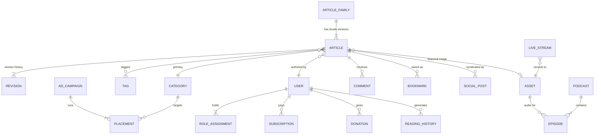

# 04 — Data Model (MongoDB Atlas)

Documents are a **persistence detail**. Domain entities are reconstituted by mappers in `adapter-mongo`; nothing outside that package sees an `ObjectId`.

---

## 1. The one decision that shapes everything: translations

A French article is not a field on an English article. It has its own slug, byline, SEO metadata, review state and publish date, and it may go live weeks apart from the original.

So: **one document per (article, locale)**, joined by `familyId`.

```text
familyId: fam_7Kd…   ──┬── articles/{_id: art_a1, locale: "en", slug: "budget-2026", status: "published"}
                       ├── articles/{_id: art_b2, locale: "fr", slug: "budget-2026", status: "in_review"}
                       └── articles/{_id: art_c3, locale: "tw", slug: "sikasɛm-2026", status: "draft"}
```

The alternative — an embedded `translations[]` array — makes per-locale workflow, per-locale indexing and per-locale cache invalidation all awkward at once. We are not doing it.

---

## 2. Entity relationships



---

## 3. Collections

| Collection | Purpose | Notable fields |
|---|---|---|
| `articles` | one per locale | `familyId`, `locale`, `slug`, `status`, `hero`, approved `narration`, `seo`, `publishedAt`, `updatedAt` |
| `article_semantic_documents` | one per published article | approved `revisionId`, retrieval text, locale, active state, retry metadata, model and `embedding[]` |
| `article_revisions` | immutable history | `articleId`, `seq`, `body`, `authorId`, `createdAt` |
| `narration_jobs` | private asynchronous article-to-audio work | `articleId`, exact `revisionId`, locale, voice, status, provider task id, ready `assetId`, failure reason and timestamps |
| `categories` | hierarchy | `parentId`, `slugs{locale}`, `names{locale}`, `order` |
| `tags` | flat | `slug`, `names{locale}`, `usageCount` |
| `role_assignments` | our RBAC, keyed by the auth user id | `roles[]` |
| `user` `session` `account` `verification` | Better Auth | managed by the library — **do not hand-edit**. Roles live in `role_assignments`, ours. |
| `media_assets` | signed Cloudinary uploads for images, video, audio, captions, transcripts and documents | `kind`, `status`, `providerId`, `secureUrl`, `altText`, `caption`, `locale`, dimensions and duration |
| `recording_imports` | idempotent private IVS-to-media promotion jobs | unique `sourceRef`, reserved `assetId`, bucket/prefix, MediaConvert task/output refs, status, failure reason and timestamps |
| `podcasts` / `episodes` | publishable audio series and accessible episodes | locale, slug, artwork; `audioAssetId`, `transcriptAssetId`, `durationSeconds`, ordered chapters, `publishedAt` |
| `galleries` | ordered photo stories and captioned video reports | kind, locale, slug, items with asset/caption ids, editorial captions, credits, `publishedAt` |
| `events` | newsroom webinars, conferences and summits | locale/slug, attendance mode, start/end window, timezone, venue, speakers, verified image, registration URL, feature/publication state |
| `broadcasts` | one billable live channel lifecycle per transmission | locale, private `channelArn`, public `playbackUrl`, `captionMode` (`in_band` or legacy `unverified`), state and start/end timestamps; never a stream key |
| `schedule_slots` | programme transmissions and replay publication | `programmeId`, locale, start/end window, `isLive`, state, immutable `replayAssetId` and required `captionAssetId` |
| `social_posts` | outbound queue | `articleId`, `platform`, `caption`, `scheduledAt`, `state`, `attempts` |
| `newsletter_subscribers` | digests | `email`, `locales[]`, `cadence`, `confirmedAt` |
| `rss_sources` | syndication in | `url`, `lastFetchedAt`, `etag` |
| `bookmarks` `reading_history` `comments` | reader activity | `readerId`, `articleId` |
| `ad_campaigns` `placements` | ad serving | `advertiserId`, `slot`, `targeting`, `budget`, `impressions` |
| `advertiser_proposals` | private self-service advertising intake | owner/contact, complete campaign request, review status/note, reviewer and activated campaign id |
| `membership_plans` | recurring support offers | slug, interval, minor-unit GHS/EUR price, benefits, explicit activation |
| `subscriptions` | reader entitlement lifecycle | `planId`, `readerId`, checkout email, price, provider references, status, `paidThrough`, cancellation |
| `donations` | one-time support | amount, provider references, optional supporter message/privacy, status and `paidAt` |
| `products` | publisher-owned shop inventory | slug, SKU, description, accessible image, minor-unit GHS/EUR price, stock and explicit activation |
| `product_orders` | physical product checkout lifecycle | product, quantity, immutable total, delivery contact, provider references, status and `paidAt` |
| `classifieds` | paid community notices | public copy, contact, asking price, placement fee, payment/review/publication state and 30-day expiry |
| `affiliate_links` | disclosed partner recommendations | public copy and imagery, server-held HTTPS destination, activation, commission note and anonymous click count |
| `page_views` | insight, append-only | `articleId`, `locale`, hashed `visitorHash`, acquisition `channel`, `occurredAt`; TTL after 400 days |
| `article_engagements` | consented, append-only attention milestones | `articleId`, `locale`, hashed `visitorHash`, 25/50/75/100 `scrollDepth`, bounded `activeSeconds`, `occurredAt`; no pointer coordinates; TTL after 400 days |
| `seo_reports` `revenue_snapshots` | insight, append-only | future time-series collections |
| `audit_logs` | who did what | `actorId`, `action`, `entity`, `before`, `after`, `at` |

---

## 4. Indexes

Revenue indexes are named and mandatory: `membership_slug_unique`,
`active_membership_plans`, `subscription_provider_ref_unique`,
`reader_entitlement`, `revenue_subscribers_recent`, `donation_provider_ref_unique`,
`donation_revenue_recent`, `donation_checkout_recent`, product slug/SKU and
provider-reference indexes, classified status/expiry and provider-reference,
affiliate destination uniqueness plus active-category lookup indexes, and
advertiser-proposal owner/history plus submitted-review-queue indexes. Proposal
approval atomically creates the active campaign and closes the submitted
proposal, so a retry cannot create an orphan or duplicate campaign.
Provider references are unique so a retried webhook
cannot create a second commercial event.

Every one of these exists because a specific screen or gate needs it.

Implemented in `packages/adapter-mongo/src/indexes.ts`, beside the queries that use them so the two cannot drift.

```js
// articles — the hot path.
// The trailing `_id: -1` matters: listings are keyset-paginated on the
// compound sort key (publishedAt, _id), so the index must cover the tiebreak
// or every page beyond the first falls back to an in-memory sort.
db.articles.createIndex({ locale: 1, slug: 1 }, { unique: true })
db.articles.createIndex({ familyId: 1, locale: 1 }, { unique: true })
db.articles.createIndex({ status: 1, publishedAt: -1, _id: -1 })            // homepage rails
db.articles.createIndex({ categoryId: 1, status: 1, publishedAt: -1, _id: -1 })
db.articles.createIndex({ tagIds: 1, status: 1, publishedAt: -1 })
db.articles.createIndex({ authorId: 1, status: 1, updatedAt: -1 })          // "my drafts" in the CMS
db.articles.createIndex({ scheduledAt: 1 }, { partialFilterExpression: { status: "scheduled" } })

// workflow + queues.
// Unique, so a concurrent double-append fails loudly instead of losing a draft.
db.article_revisions.createIndex({ articleId: 1, seq: -1 }, { unique: true })
db.social_posts.createIndex({ state: 1, scheduledAt: 1 })
db.audit_logs.createIndex({ entity: 1, entityId: 1, at: -1 })

// Studio media library
db.media_assets.createIndex({ locale: 1, status: 1, _id: -1 })
db.schedule_slots.createIndex({ locale: 1, state: 1, isLive: 1, endsAt: -1 })
db.podcasts.createIndex({ locale: 1, published: 1, _id: -1 })
db.episodes.createIndex({ podcastId: 1, published: 1, publishedAt: -1, _id: -1 })
db.galleries.createIndex({ locale: 1, published: 1, publishedAt: -1, _id: -1 })
db.events.createIndex({ locale: 1, slug: 1 }, { unique: true })
db.events.createIndex({ locale: 1, published: 1, endsAt: 1, startsAt: 1 })

// reader activity
db.bookmarks.createIndex({ readerId: 1, articleId: 1 }, { unique: true })
db.reading_history.createIndex({ readerId: 1, at: -1 })
db.comments.createIndex({ articleId: 1, at: -1 })
db.page_views.createIndex({ articleId: 1, occurredAt: -1 })
db.page_views.createIndex({ visitorHash: 1, occurredAt: -1 })

// TTL — GDPR retention
db.page_views.createIndex({ occurredAt: 1 }, { expireAfterSeconds: 34560000 }) // 400 days
db.article_engagements.createIndex({ articleId: 1, visitorHash: 1, scrollDepth: 1, occurredAt: -1 })
db.article_engagements.createIndex({ occurredAt: 1 }, { expireAfterSeconds: 34560000 }) // 400 days
db.sessions.createIndex({ expires: 1 }, { expireAfterSeconds: 0 })
```

### Lexical search — `$text` today, Atlas Search when relevance demands it

R1 ships MongoDB's own `$text` index, weighted so a term in the headline outranks the same term in the body:

```js
db.articles.createIndex(
  { title: "text", slug: "text" },
  { name: "article_text", weights: { title: 10, slug: 2 }, default_language: "english" },
)
```

**Why not Atlas Search yet.** Atlas Search requires `mongot`, which MongoDB Community does not ship — so it cannot run in a Testcontainer, and a search adapter that only works in production is one nobody can test. `$text` gives stemming, stop words and relevance scoring, runs everywhere, and is honest about what it is.

Atlas Search is a **second implementation of the same `SearchPort`** and one wiring line, taken when relevance matters more than portability. The index definition below is kept ready for that day.

### Atlas Search — global + lexical search (R2)

```json
{
  "mappings": { "dynamic": false, "fields": {
    "title":   { "type": "string", "analyzer": "lucene.standard" },
    "excerpt": { "type": "string" },
    "body":    { "type": "string" },
    "locale":  { "type": "token" },
    "status":  { "type": "token" },
    "publishedAt": { "type": "date" }
  }}
}
```

### Atlas Vector Search — semantic search + "recommended articles"

```json
{
  "fields": [
    { "type": "vector", "path": "embedding", "numDimensions": 1024, "similarity": "cosine" },
    { "type": "filter", "path": "locale" },
    { "type": "filter", "path": "status" }
  ]
}
```

The index is named `article_semantic_vector` on
`article_semantic_documents`. Go queues the exact approved revision on publish,
and a protected cron writes a manual Voyage `voyage-4` document embedding.
Reader queries use the matching query input type. Search results are reloaded
from `articles` and checked for public visibility before delivery, so an
unpublished article cannot leak from a stale vector document. Drafts are never
embedded; lexical search and category siblings remain fail-soft fallbacks.

---

### Two fields that are persistence, not domain

- **`_id` is our own id string**, not an `ObjectId`. Ids are minted by `IdPort`, so the domain owns identity and an exported document still means something.
- **`articles.updatedAt`** exists only so the CMS can sort "my drafts" by recency. No business rule reads it, so it is not on the `Article` entity — the repository stamps it from an injected `ClockPort`, which keeps it deterministic in tests.

### Credited article hero snapshot

`articles.hero` stores the selected ready image's `assetId`, immutable delivery URL,
alt text, caption, credit and dimensions. The article keeps this publish-time
snapshot so its byline media remains attributable and renderable even if the
media-library record is later reorganised. Studio may attach only a ready image
from the article's locale (or a locale-neutral asset); the domain requires an
HTTPS delivery URL, useful alternative text, a visible credit and positive
dimensions.

### Public newsroom profiles

`staff_profiles` stores one translated profile per `(userId, locale)`: a stable
public slug, display name, newsroom title, approved biography, verified portrait
asset id, HTTPS social links and publication state. Unique indexes on
`(userId, locale)` and `(locale, slug)` prevent duplicate identity and URL races;
the public-team index orders published profiles by display name. Editing a live
profile returns it to draft, and publication resolves a ready image through the
media library before exposing its delivery metadata.

### VOD delivery projection

Video originals remain immutable `media_assets`; derived renditions are not new
database records. `VideoDeliveryPort` projects a ready video at read time into
Cloudinary's adaptive `sp_auto` HLS manifest and a first-frame JPEG poster. This
keeps cacheable provider URLs deterministic, avoids persisting transient
transformation state and preserves the original as the fallback for assets
outside Cloudinary. Video-gallery publication still requires a separate ready
caption asset before any rendition is publicly reachable.

## 5. Consistency rules

MongoDB gives us no foreign keys, so these are enforced in the domain and verified by integration tests:

1. A `social_posts` row may only reference an article whose `status = "published"`.
2. `article_revisions.seq` is monotonic per `articleId`; `RestoreRevision` appends a new revision rather than rewinding.
3. `assets` referenced by a published article are soft-deleted only, never removed.
4. `audit_logs` and the three `insight` collections are append-only. The Mongo user for `apps/web` has no `update` or `delete` grant on them.
5. Multi-document writes that must not tear (publish = article + revision + audit) run inside a transaction. Atlas replica sets support this; a standalone dev `mongod` does not, which is why local dev uses a single-node replica set.
