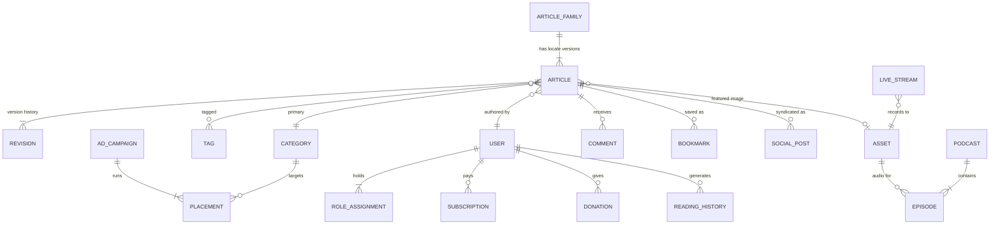

# 04 — Data Model (MongoDB Atlas)

Documents are a **persistence detail**. Domain entities are reconstituted by mappers in `adapter-mongo`; nothing outside that package sees an `ObjectId`.

---

## 1. The one decision that shapes everything: translations

A French article is not a field on an English article. It has its own slug, byline, SEO metadata, review state and publish date, and it may go live weeks apart from the original.

So: **one document per (article, locale)**, joined by `familyId`.

```
familyId: fam_7Kd…   ──┬── articles/{_id: art_a1, locale: "en", slug: "budget-2026", status: "published"}
                       ├── articles/{_id: art_b2, locale: "fr", slug: "budget-2026", status: "in_review"}
                       └── articles/{_id: art_c3, locale: "tw", slug: "sikasɛm-2026", status: "draft"}
```

The alternative — an embedded `translations[]` array — makes per-locale workflow, per-locale indexing and per-locale cache invalidation all awkward at once. We are not doing it.

---

## 2. Entity relationships



---

## 3. Collections

| Collection | Purpose | Notable fields |
|---|---|---|
| `articles` | one per locale | `familyId`, `locale`, `slug`, `status`, `body`, `seo`, `embedding[]`, `publishedAt` |
| `article_revisions` | immutable history | `articleId`, `seq`, `body`, `authorId`, `createdAt` |
| `categories` | hierarchy | `slug`, `parentId`, `names{locale}` |
| `tags` | flat | `slug`, `names{locale}`, `usageCount` |
| `users` | staff + readers | `email`, `roles[]`, `twoFactor`, `profile` |
| `accounts` `sessions` `verification_tokens` | Auth.js adapter | managed by `@auth/mongodb-adapter` — **do not hand-edit** |
| `assets` | images, audio, video | `kind`, `storageKey`, `muxAssetId`, `width`, `height`, `alt{locale}` |
| `podcasts` / `episodes` | audio series | `episodes.assetId`, `duration`, `transcript` |
| `live_streams` | Live TV | `muxStreamId`, `state`, `startedAt`, `viewerPeak` |
| `social_posts` | outbound queue | `articleId`, `platform`, `caption`, `scheduledAt`, `state`, `attempts` |
| `newsletter_subscribers` | digests | `email`, `locales[]`, `cadence`, `confirmedAt` |
| `rss_sources` | syndication in | `url`, `lastFetchedAt`, `etag` |
| `bookmarks` `reading_history` `comments` | reader activity | `readerId`, `articleId` |
| `ad_campaigns` `placements` | ad serving | `advertiserId`, `slot`, `targeting`, `budget`, `impressions` |
| `subscriptions` `donations` | revenue | `provider`, `providerRef`, `currency`, `status` |
| `page_views` `seo_reports` `revenue_snapshots` | insight, append-only | time-series collections |
| `audit_logs` | who did what | `actorId`, `action`, `entity`, `before`, `after`, `at` |

---

## 4. Indexes

Every one of these exists because a specific screen or gate needs it.

```js
// articles — the hot path
db.articles.createIndex({ locale: 1, slug: 1 }, { unique: true })
db.articles.createIndex({ familyId: 1, locale: 1 }, { unique: true })
db.articles.createIndex({ status: 1, publishedAt: -1 })            // category listing, homepage rails
db.articles.createIndex({ categoryId: 1, status: 1, publishedAt: -1 })
db.articles.createIndex({ tagIds: 1, status: 1, publishedAt: -1 })
db.articles.createIndex({ authorId: 1, status: 1, updatedAt: -1 }) // "my drafts" in the CMS
db.articles.createIndex({ scheduledAt: 1 }, { partialFilterExpression: { status: "scheduled" } })

// workflow + queues
db.article_revisions.createIndex({ articleId: 1, seq: -1 })
db.social_posts.createIndex({ state: 1, scheduledAt: 1 })
db.audit_logs.createIndex({ entity: 1, entityId: 1, at: -1 })

// reader activity
db.bookmarks.createIndex({ readerId: 1, articleId: 1 }, { unique: true })
db.reading_history.createIndex({ readerId: 1, at: -1 })
db.comments.createIndex({ articleId: 1, at: -1 })

// TTL — GDPR retention
db.page_views.createIndex({ at: 1 }, { expireAfterSeconds: 34560000 })   // 400 days
db.sessions.createIndex({ expires: 1 }, { expireAfterSeconds: 0 })
```

### Atlas Search — global + lexical search

```json
{
  "mappings": { "dynamic": false, "fields": {
    "title":   { "type": "string", "analyzer": "lucene.standard" },
    "excerpt": { "type": "string" },
    "body":    { "type": "string" },
    "locale":  { "type": "token" },
    "status":  { "type": "token" },
    "publishedAt": { "type": "date" }
  }}
}
```

### Atlas Vector Search — semantic search + "recommended articles"

```json
{
  "fields": [
    { "type": "vector", "path": "embedding", "numDimensions": 1024, "similarity": "cosine" },
    { "type": "filter", "path": "locale" },
    { "type": "filter", "path": "status" }
  ]
}
```

Embeddings are written by `media-svc` on publish, not on save — drafts change too often to be worth embedding.

---

## 5. Consistency rules

MongoDB gives us no foreign keys, so these are enforced in the domain and verified by integration tests:

1. A `social_posts` row may only reference an article whose `status = "published"`.
2. `article_revisions.seq` is monotonic per `articleId`; `RestoreRevision` appends a new revision rather than rewinding.
3. `assets` referenced by a published article are soft-deleted only, never removed.
4. `audit_logs` and the three `insight` collections are append-only. The Mongo user for `apps/web` has no `update` or `delete` grant on them.
5. Multi-document writes that must not tear (publish = article + revision + audit) run inside a transaction. Atlas replica sets support this; a standalone dev `mongod` does not, which is why local dev uses a single-node replica set.
